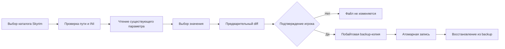

# FrameForge

FrameForge не обещает универсальный прирост FPS. Результат зависит от компьютера, разрешения, драйверов, модов и сцены. Изменения игровых файлов выполняются только после просмотра diff и отдельного подтверждения.

## Возможности

- Локальный обзор CPU, потоков, RAM, системного диска и, если доступен Windows CIM, названия GPU.
- Read-only обнаружение Skyrim в Steam через `libraryfolders.vdf` и `appmanifest_489830.acf`.
- Каталог 22 игр: Skyrim Special Edition с двумя обратимыми профилями травы; CS:GO Legacy с отдельным экраном профилей, автоматическим поиском Steam-папки, установкой console-menu в `csgo/cfg` и загрузкой FPS-профиля из игрового меню; ещё 20 игр имеют рекомендации и чек-листы.
- A/B-анализ CSV времён кадров: средний FPS, 1% low, медиана, p99 frametime и описательный разброс хвоста `p99 − медиана` для каждого прогона. Можно импортировать сразу несколько прогонов; общий тег игры/сцены применяется ко всем, а некорректные файлы перечисляются отдельно. Для повторов можно подобрать ближайший более ранний замер с теми же явно указанными игрой, сценой и типом метрики, либо открыть все прогоны с точно такими же метками, включая закреплённые эталоны. Один эталон можно назначить активной базой на текущий сеанс, затем подставить его и выбранный прогон в поля A/B; отчёт строится только после отдельного нажатия «Сравнить». Роли выбранных прогонов можно поменять местами; это сбрасывает открытый отчёт, поэтому новый результат нужно построить вручную. Последние 10 вручную выполненных A/B-сравнений доступны в свёрнутом списке сеанса; авто-сравнение после импорта и простая перестановка туда не попадают. Сохранённый порядок A/B остаётся частью каждой пары: обратный порядок после повторного нажатия «Сравнить» записывается как отдельная пара. Отчёт сравнения можно скопировать в буфер обмена целиком, включая имена CSV-прогонов и введённые заметки; копирование не создаёт файл и не использует сеть. Повторный выбор пары требует снова нажать «Сравнить». Пары, чей прогон больше не находится в истории, помечаются недоступными. Порядок списка истории не подтверждает хронологию захвата; просмотр не вычисляет тренд. Захват измерений остаётся внешним и пользовательским.
- При импорте приложение предупреждает о вероятном дубликате, если совпадают игра, сцена, тип метрики, рассчитанные агрегаты и заполненный пользователем контекст замера (заметка, снимок настройки и пункты чек-листа); имя CSV в проверке не используется. По умолчанию отмеченный файл пропускается, но пользователь может добавить его явно; совпадение сводок не доказывает совпадение исходных CSV или захватов. Для прогонов короче 30 кадров эта подсказка отключена.
- Дополнительные описательные счётчики PresentMon `MsCPUBusy` / `CPUBusy`, `MsGPUTime` / `GPUTime` и `MsGPUBusy` / `GPUBusy`: медиана, p95 и покрытие допустимыми строками в локальном отчёте. Они не диагностируют узкое место; GPU time не равен GPU busy.
- Frame budget для 30/60/90/120/144/165/240 FPS: доля принятых CSV-кадров, уложившихся в точный порог `1000/FPS`, с сравнением A/B и повторных групп.
- Сравнение повторных замеров: не менее трёх CSV на вариант, медиана и межквартильный диапазон сводок по отдельным файлам; локальный отчёт также показывает анонимные значения каждого прогона и число принятых кадров. Требуются одинаковые метки игры, сцены и типа frametime; группы выбираются временно и не сохраняются в историю.
- Отдельный агрегированный CSV/JSON для повторного сравнения содержит медианы, квартили и число запусков, а также выбранный frame budget и его агрегированную долю, если все записи группы содержат этот показатель. При старых/смешанных группах бюджетная сводка не рассчитывается по неполному набору; отчёт и экспорт указывают, для скольких CSV данные доступны. Экспорт не включает имена CSV, метки или исходные кадры. Отчёт описательный и не заявляет статистическую значимость или причинный эффект.
- Текстовый отчёт дополнительно показывает нормированную долю кадров по каждому диапазону и предупреждает о заметно различающемся размере выборок.
- Экспорт сравнения в CSV или JSON содержит только сводные метрики и распределение, без имени исходного файла, пути или сырых кадров. Парный JSON использует `schema_version: 4`; имя профиля/версии игры в экспорт не включается, чтобы не раскрывать его косвенно.
- Диаграмма сравнивает долю кадров по шести диапазонам времени — от быстрых кадров до редких длинных задержек.
- История сохраняет до 100 обычных и пяти закреплённых эталонных прогонов между запусками. Эталоны не вытесняются новыми импортами и доступны в поиске и селекторах Baseline/Variant. Снятие эталона при заполненной обычной истории требует подтверждения: самая старая обычная запись будет удалена, если лимит снова превысится. В `%LOCALAPPDATA%\FrameForge\benchmarks.json` записываются имя CSV, числовые метрики, необязательные метки игры/сцены, заметка об изменении до 160 символов, флаг эталона и, только по отдельному флажку, снимок одного текущего разрешённого параметра Skyrim. Снимок включает только имя ключа и целое значение; путь к INI, исходные CSV, кадры и абсолютные пути не сохраняются. Снимок считывается через ту же проверку allowlist, что и профиль. Метки, заметка, снимок, флаг эталона и PresentMon-счётчики остаются на этом компьютере и не включаются в отчёты CSV/JSON. Не вводи в метки и заметки личные пути или другие чувствительные данные. При разных метках сравнение предупреждает, что прогоны могут быть несопоставимы.
- Предварительный unified diff, побайтовая backup-копия с SHA-256, атомарная запись и откат с проверкой сохранённой контрольной суммы.
- Отказ от неправильного/неизвестного файла, отсутствующего или повторного ключа, неразрешённых значений, symlink и Windows junction/reparse point.
- Перед заменой FrameForge сверяет SHA-256 текущего INI с ожидаемым, затем повторно проверяет allowlist пути и reparse points. Эти проверки не атомарны: правка содержимого или обычная замена INI после проверки хэша, но до `os.replace`, не обнаруживается и может быть перезаписана, если путь всё ещё проходит проверку. Junction, появившийся до повторной проверки пути, приводит к отказу. Если родительский каталог переименован и заменён junction уже после этой проверки, временный файл, созданный заранее в исходном каталоге, обычно становится недоступен по прежнему пути и `os.replace` завершается ошибкой; подмена самого INI в том же каталоге после проверки всё ещё может быть заменена. FrameForge не использует handle-based I/O и не защищает от конкурентных локальных процессов.
- Без сетевых вызовов, аналитики, аккаунта, инжекторов, правок реестра, «чистки RAM», разгона, остановки служб и обхода античита.

## Установка и запуск

Готовая Windows-сборка будет доступна в [последнем GitHub Release](https://github.com/GhosTnever-lkm/frameforge/releases/latest). Распакуй архив и запусти `FrameForge\FrameForge.exe`; установка и права администратора не нужны.

Для запуска из исходного кода нужен Python 3.10+ и Qt for Python Essentials:

```powershell
python -m venv .venv
.\.venv\Scripts\Activate.ps1
python -m pip install -e .
frameforge
```

Для локальной сборки portable-папки с `.exe` выполни `./build_windows.ps1` из PowerShell на Windows. Архив и SHA-256 появятся в `dist/`.

В интерфейсе открой **Оптимизатор**, выбери `Documents\My Games\Skyrim Special Edition`, проверь текущее значение и diff. Закрой игру перед применением, чтобы она не перезаписала настройки. Нажми «Применить» и подтверди действие. Копии сохраняются в `%LOCALAPPDATA%\FrameForge\backups`.

Для CS:GO Legacy открой **Игры** и выбери режим: максимальный FPS, плавность 144/240 Гц, сбалансированный или свои параметры. FrameForge показывает CFG-предпросмотр, автоматически находит игру в Steam и перед запуском создаёт `frameforge_menu.cfg`, FPS-профиль и, если включена автозагрузка, помеченный блок в `autoexec.cfg`. Кнопка запуска предварительно спрашивает разрешение изменить эти файлы; существующие заменяемые файлы сохраняются рядом в датированной резервной копии. При включённой автозагрузке autoexec исполняет меню и переключает консоль, чтобы показать его в игре. Выключи автозагрузку, чтобы убрать только помеченный блок FrameForge и сохранить личные строки autoexec. Команды тёмного/скрытого неба работают только в локальной практике. Красный контрастный профиль меняет цвет прицела, а не цвет моделей противников; штатного клиентского CFG-переключателя для перекраски вражеских моделей не найдено. Это меню внутри игровой консоли, а не отдельное окно с мышиным VGUI. Приложение не обещает фиксированный прирост: оцени его встроенным сравнением одинаковой сцены до и после.

## Профиль Skyrim Special Edition

FrameForge поддерживает два существующих ключа в стандартной папке `Documents\My Games\Skyrim Special Edition`:

- `SkyrimPrefs.ini` → `[Grass] fGrassStartFadeDistance`: 1000, 3000, 5000 или 7000. Меньшее значение сокращает дальность отображения травы, поэтому pop-in будет заметнее. [Описание параметра](https://stepmodifications.org/wiki/Guide:SkyrimPrefs_INI/Grass).
- `Skyrim.ini` → `[Grass] iMinGrassSize`: 40, 60, 80 или 0. 40/60/80 постепенно уменьшают плотность травы; `0` убирает траву полностью и резко меняет картинку. Отрицательные значения недоступны, поскольку руководство предупреждает о возможных вылетах. [Описание плотности травы](https://stepmodifications.org/wiki/Guide:Skyrim_INI/Grass).

Изменение значения `iMinGrassSize` не является гарантией конкретного прироста FPS: эффект зависит от сцены, модов и системы.

Если ключа нет, он повторяется, файл находится вне текущей папки Documents или у игры отдельный профиль Mod Organizer, FrameForge остановится и ничего не запишет. На Windows папка Documents определяется через [`SHGetKnownFolderPath`](https://learn.microsoft.com/en-us/windows/win32/api/shlobj_core/nf-shlobj_core-shgetknownfolderpath), поэтому приложение учитывает перенаправление Documents в OneDrive. Проверяй, что выбранный файл действительно используется твоим профилем. Для CS:GO Legacy панель создаёт отдельный профиль локальной практики с ночным небом или выключенной отрисовкой skybox.

## Каталог игр

CS:GO Legacy (Counter-Strike: Global Offensive), Counter-Strike 2, Dota 2, Apex Legends, PUBG: Battlegrounds, Fortnite, VALORANT, Minecraft Java Edition, Cyberpunk 2077, GTA V, The Witcher 3, Rust, Warframe, Marvel Rivals, Call of Duty: Warzone, Overwatch 2, Elden Ring, Red Dead Redemption 2, Baldur's Gate 3, Hogwarts Legacy и Forza Horizon 5 доступны в каталоге. CS:GO Legacy имеет запуск через Steam и генерируемые CFG-профили; остальные игры снабжены рекомендациями и чек-листами для замера.

Для ручной проверки меняй по одному параметру: тени, объёмные эффекты, отражения и дальность растительности. Снижай render scale только если ограничение идёт со стороны GPU. Подбирай качество текстур по доступной видеопамяти, ограничивай частоту кадров с учётом дисплея. Сравнивай одну и ту же сцену.

## Анализ замеров

На странице **Бенчмарк** можно импортировать собственный CSV с колонкой `frame_time_ms` или CSV PresentMon с `MsBetweenDisplayChange` / `MsBetweenPresents`. Если присутствуют оба столбца PresentMon, используется `MsBetweenDisplayChange`; иначе берётся `MsBetweenPresents`, и приложение предупреждает, что сравнивается CPU-presented frametime. Для этих столбцов `FrameType` тоже учитывается: displayed принимает `Application`, `Intel_XEFG` и `AMD_AFMF`, а CPU-presented — только `Application`. Импорт предупреждает о неизвестных или отброшенных строках. Поддерживаются разделители запятая, точка с запятой и табуляция; десятичная запятая принимается с `;` и табуляцией.

Если в CSV присутствуют, FrameForge также суммирует `MsCPUBusy` (или старый заголовок `CPUBusy`), `MsGPUTime` (`GPUTime`) и `MsGPUBusy` (`GPUBusy`) на тех же принятых строках и том же фильтре `FrameType`. Для каждого доступного столбца локальный A/B-отчёт показывает медиану, p95 и покрытие строк. Coverage — доля валидных значений среди строк, принятых для основной метрики frametime, а не среди всех строк исходного CSV. Ноль сохраняется как записанное значение; пустые, нечисловые, отрицательные, бесконечные и значения выше 10 000 мс пропускаются. Отсутствующий или частично заполненный столбец не означает, что CPU/GPU простаивал. Эти счётчики описывают работу на кадр и не устанавливают причину ограничения FPS. GPU time и GPU busy имеют разные определения. Доступность и точность GPU-счётчиков зависят от версии/настроек PresentMon и системы; документация PresentMon предупреждает о сниженной точности некоторых GPU execution metrics при HWS. Источник: [PresentMon CSV-колонки и определения](https://github.com/GameTechDev/PresentMon/blob/main/README-ConsoleApplication.md), [ограничения PresentMon](https://github.com/GameTechDev/PresentMon).

Сводка показывает средний FPS, 1% low, медиану и p99 frametime. Для пары также отображается разброс хвоста `p99 − медиана` по каждому прогону: это описательная характеристика текущей выборки, а не статистический тест и не обещание воспринимаемой плавности. Диаграмма сравнивает долю кадров в шести диапазонах: `<8,333`, `[8,333–16,667)`, `[16,667–33,333)`, `[33,333–50)`, `[50–100)` и `≥100` мс. Пороги соответствуют `1000/FPS`, подписи округлены. В легенде указано число кадров для каждого замера. При малом количестве кадров распределение менее устойчиво; приложение предупреждает, если размер выборок различается более чем на 5%.

В отчёте можно выбрать frame budget 30, 60, 90, 120, 144, 165 или 240 FPS. FrameForge показывает число и долю принятых строк, у которых время кадра не превышает точный порог `1000/FPS` (для 60 FPS подпись: `1000/60 мс (≈16.666667 мс)`), отдельно для A и B. Десятичная подпись приблизительная; сравнение использует полное значение `1000/FPS` и исходное число из CSV без округления или допуска. Для повторных групп сначала рассчитывается процент каждого CSV, затем медиана и межквартильный диапазон этих процентов. Значение описывает только выбранный порог и не означает, что игра стабильно выдаёт этот FPS или воспринимается плавной; одиночный длинный кадр может мало повлиять на долю. Настраиваемый произвольный порог не входит в эту версию.

В диалоге импорта можно выделить несколько CSV. Для каждого файла метка игры, сцены и текущие отмеченные пункты одинаковы. Если отдельный CSV не читается, остальные корректные прогоны сохраняются, а ошибки перечисляются после импорта с номером выбора; длинные списки показывают, сколько строк скрыто. Если все метрики, агрегаты и заполненные пользователем метки (кроме имени файла) точно совпадают с другой записью не короче 30 кадров, FrameForge показывает общий прокручиваемый список вероятных совпадений с номером CSV из выбора и именем файла. Список прокручивается, его высота подстраивается под рабочую область экрана, а кнопки действий остаются снаружи прокрутки. Галочка «Добавить всё равно» сохраняет выбранный файл, без неё он пропускается. Точное совпадение агрегатов может возникнуть и у разных захватов; это только подсказка. Кнопка «Добавить уникальные, пропустить совпадения» сохраняет непомеченные совпадения как пропущенные и всё равно импортирует остальные корректные файлы; «Продолжить выбранные» также добавит отмеченные совпадения; отдельная кнопка отменяет весь пакет. История ограничена 100 обычными замерами и пятью эталонами; при пакетном добавлении вытесняются только самые старые обычные записи. После импорта пары автоматически показываются две последние записи итоговой истории (включая эталоны), а фильтр списка сбрасывается.

Чтобы найти замер для назначения в группу, используй фильтр списка: он ищет без учёта регистра по имени CSV, игре, сцене, типу frametime, заметке и снимку настройки. Изменение фильтра снимает текущее выделение, чтобы скрытые результаты случайно не попали в группы; уже назначенные группы при этом сохраняются, а строка состояния показывает, сколько участников каждой группы скрыто фильтром. Фильтр ограничивает только список замеров для групп, а поля Baseline/Variant используют всю историю.

Для парного сравнения можно найти замер по имени файла, игре, сцене, типу, заметке, снимку настройки или чек-листу. Поиск показывает отдельный список результатов с номером позиции в истории; одинаковые имена файлов поэтому различаются. Ввод, очистка запроса и отсутствие результатов не меняют A/B. Выбери результат и нажми «Назначить выбранный как Baseline (A)» или «Назначить выбранный как Variant (B)»; затем запусти сравнение. Если изменить A или B после отчёта, старый парный отчёт и его экспорт сбрасываются до нового сравнения. Групповое сравнение всегда включает все назначенные в A/B прогоны, в том числе скрытые фильтром. Экспортирует последнюю выбранную пару или группу, независимо от фильтра списка.

Для каждого прогона можно добавить локальную заметку об изменении настроек и вручную отметить применённые пункты игрового чек-листа. A/B-отчёт показывает заметки и различия отметок только как пользовательский контекст и явно говорит, что они не доказывают причину изменения FPS. Если выбраны разные игры, списки подписываются названием каждой игры и не сравниваются между собой. Отметки не считываются из файлов игры и не меняют их. Для Skyrim доступен отдельный снимок текущего разрешённого параметра, выбранного в **Оптимизаторе**. Снимок читается через существующие проверки пути и allowlist и сохраняет только пару `имя ключа + целое значение`. Если папка Skyrim не выбрана или путь не прошёл проверку, импорт отменяется. Снимок относится ко времени импорта CSV и сам по себе не подтверждает, что замер был сделан именно при этом значении.

Чтобы сравнить повторы, выдели CSV-замеры в истории с помощью Ctrl/Shift и назначь их кнопками в группу A или B. Нужно минимум по три отдельных файла на вариант, с одинаковыми метками игры, сцены и типа frametime. Сводка показывает медиану и межквартильный диапазон результатов, вычисленных отдельно для каждого CSV. Поэтому `1% low по CSV` и `p99 frametime по CSV` — медианы показателей отдельных прогонов, а не pooled-процентили группы. Кадры между файлами не объединяются, и каждый файл имеет одинаковый вес независимо от числа кадров или длительности замера. Таблица отчёта показывает индекс, число принятых кадров (`n_frames`), средний FPS, 1% low и p99 для каждого CSV отдельно; индекс следует порядку истории и не подтверждает хронологию захвата, а `n_frames` не является длительностью замера. При 3–4 прогонах IQR особенно чувствителен к одному замеру. Группы существуют только до закрытия приложения и не считаются записанными сессиями. Group CSV/JSON экспорт остаётся агрегатным: содержит медианы, квартили, количества прогонов и тип метрики; таблица отдельных CSV, игра, сцена, имена исходных файлов, пользовательские метки и заметки в экспорт не входят. Перекрытие квартилей — описательная подсказка, не тест значимости; порядок прогонов, нагрев, фоновые процессы и другие условия приложение не знает.

До 100 обычных сводок и пяти закреплённых эталонов хранятся локально в `%LOCALAPPDATA%\FrameForge\benchmarks.json`. Новые импорты вытесняют только самые старые обычные прогоны; эталонные записи сохраняют исходное положение среди оставшихся строк и доступны для выбора в A/B. История содержит имя CSV, метрики и выбранные пользователем локальные метки, заметки, снимки, отметки чек-листов, сводки PresentMon с покрытием и, начиная с v1.2, семь целочисленных frame-budget-счётчиков для новых импортов. Отдельные кадры и абсолютные пути не сохраняются. Старые записи после миграции получают `null` для новых счётчиков: отчёт показывает «нет данных», а не 0%. Метки, заметки, снимки, отметки чек-листа, PresentMon-счётчики и флаг эталона не включаются в экспорт CSV/JSON; экспорт содержит выбранный целевой FPS и только агрегированную долю в бюджете. Тип метрики включается в экспорт; сравнение разных типов остаётся доступным, но явно помечается как напрямую несопоставимое. Доля в правых диапазонах показывает, что в прогоне было больше медленных кадров, но не устанавливает причину разницы. Повторяй замеры на одной сцене и в одинаковых условиях. Например:

```csv
frame_time_ms
16.7
16.4
22.1
```

Импортируй два замера и выбери Baseline (A) и Variant (B). 1% low рассчитывается как обратное среднее времени худшего 1% кадров. FrameForge не захватывает кадры самостоятельно, не внедряется в игры и не устанавливает причинную связь между настройкой и результатом.

## Схема безопасного применения



## Проверки

```powershell
python -m pip install -e .
python -m unittest discover -s tests -v
python -m compileall -q src tests
```

## Ограничения

- Версии 1.7.0 и 1.6.0 добавляют закреплённые эталонные прогоны и описательный разброс хвоста frametime (`p99 − медиана`) соответственно. Эталоны сохраняются в истории, но не экспортируются как пользовательская метка; схема истории обновлена до v9, а прежние записи мигрируют с выключенным флагом эталона. Версия 1.2.0 добавляет frame-budget-счётчики для семи фиксированных FPS-порогов; в истории остаются только агрегированные количества, а старые записи честно показывают отсутствие данных. Выбранный порог и агрегированная доля доступны в отчёте и экспорте. Схема локальной истории — v9; схемы v1–v8 мигрируют без выдуманных бюджетных значений. Версия 1.1.0 добавила локальные сводки PresentMon CPU/GPU-счётчиков и покрытие валидными строками; эти данные не входят в экспорт и не используются для определения bottleneck. Версия 1.0.0 добавила сравнение повторных замеров по медиане и межквартильному диапазону, с отдельным агрегированным экспортом. Версия 1.0.1 добавила в локальный отчёт отдельные анонимные значения CSV и `n_frames`; эти строки не попадают в экспорт. Выбор групп временный и требует совпадения игры, сцены и метрики.
- Версия 0.4.0 добавляет нормированные дельты по диапазонам frametime и предупреждение при разном числе кадров; история хранится локально.
- Версия 0.5.0 добавляет локальный экспорт агрегированной A/B-сводки в CSV и JSON.
- Версия 0.6.0 добавила локальные метки игры и сцены/пресета к замерам. Версия 0.7.0 добавила тип метрики и заметку об изменении; версия 0.8.0 добавила opt-in снимок разрешённого параметра Skyrim; версия 0.9.0 добавила ручные игровые чек-листы. История использует схему v9 и мигрирует схемы v1–v8 при чтении. Старые версии FrameForge могут не читать историю после обновления формата. Название метрики и агрегированная доля выбранного frame budget включаются в CSV/JSON экспорт; пользовательские метки, заметки, снимки, отметки чек-листа, дополнительные PresentMon-счётчики и флаг эталона — нет.
- Skyrim имеет обратимые профили INI; CS:GO Legacy получает генерируемый CFG-профиль с резервной копией; остальные 20 игр сопровождаются рекомендациями и чек-листами.
- Health scan не измеряет FPS, температуры или нагрузку GPU и ничего не меняет в системе.
- Соревновательные игры остаются в режиме рекомендаций, чтобы не задевать файлы, Steam Cloud и античит.
- Графический интерфейс этой версии на русском языке.

## Лицензия

MIT. См. [LICENSE](LICENSE).

## ☕ Support / Pro Version

FrameForge бесплатен и открыт под MIT. Пока нет отдельной Pro-функциональности, которую можно честно предложить за деньги; поддержка не включает закрытые функции. [Buy Me a Coffee](https://buymeacoffee.com/azizazimov8) · [Boosty](https://boosty.to/azizazim).

## Источники выбора игр

Список — практический каталог, не рейтинг и не обещание поддержки автоматических настроек. Для выбора игр ориентировались на публичные [Steam Charts](https://store.steampowered.com/charts/) и [PC & Console Rankings by Newzoo](https://newzoo.com/articles/july-2026-pc-console-rankings).
