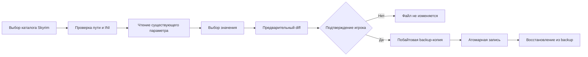

# FrameForge

**Локальный и обратимый тюнинг игр для Windows 10/11.** FrameForge показывает сведения о системе, находит установленные Steam-игры и ведёт каталог безопасных настроек. В версии 0.2.0 есть два автоматических профиля травы Skyrim Special Edition и руководства внутриигровых настроек для ещё 12 популярных игр.

FrameForge не обещает универсальный прирост FPS. Результат зависит от компьютера, разрешения, драйверов, модов и сцены. Изменения игровых файлов выполняются только после просмотра diff и отдельного подтверждения.

## Возможности

- Локальный обзор CPU, потоков, RAM, системного диска и, если доступен Windows CIM, названия GPU.
- Read-only обнаружение Skyrim в Steam через `libraryfolders.vdf` и `appmanifest_489830.acf`.
- Каталог 13 популярных игр: два обратимых профиля травы для Skyrim Special Edition и внутриигровые рекомендации для ещё 12 игр.
- A/B-анализ CSV времён кадров: средний FPS, 1% low, медиана и p99 frametime. Захват измерений остаётся внешним и пользовательским.
- Диаграмма сравнивает долю кадров по шести диапазонам времени — от быстрых кадров до редких длинных задержек.
- Предварительный unified diff, побайтовая backup-копия с SHA-256, атомарная запись и откат с проверкой сохранённой контрольной суммы.
- Отказ от неправильного/неизвестного файла, отсутствующего или повторного ключа, неразрешённых значений, symlink и Windows junction/reparse point.
- Без сетевых вызовов, аналитики, аккаунта, инжекторов, правок реестра, «чистки RAM», разгона, остановки служб и обхода античита.

## Установка и запуск

Готовая Windows-сборка будет доступна в [последнем GitHub Release](https://github.com/GhosTnever-lkm/frameforge/releases/latest). Распакуй архив и запусти `FrameForge\FrameForge.exe`; установка и права администратора не нужны.

Для запуска из исходного кода нужен Python 3.10+ и Qt for Python Essentials:

```powershell
python -m venv .venv
.\.venv\Scripts\Activate.ps1
python -m pip install -e .
frameforge
```

Для локальной сборки portable-папки с `.exe` выполни `./build_windows.ps1` из PowerShell на Windows. Архив и SHA-256 появятся в `dist/`.

В интерфейсе открой **Оптимизатор**, выбери `Documents\My Games\Skyrim Special Edition`, проверь текущее значение и diff. Закрой игру перед применением, чтобы она не перезаписала настройки. Нажми «Применить» и подтверди действие. Копии сохраняются в `%LOCALAPPDATA%\FrameForge\backups`.

## Профиль Skyrim Special Edition

FrameForge поддерживает два существующих ключа в стандартной папке `Documents\My Games\Skyrim Special Edition`:

- `SkyrimPrefs.ini` → `[Grass] fGrassStartFadeDistance`: 1000, 3000, 5000 или 7000. Меньшее значение сокращает дальность отображения травы, поэтому pop-in будет заметнее. [Описание параметра](https://stepmodifications.org/wiki/Guide:SkyrimPrefs_INI/Grass).
- `Skyrim.ini` → `[Grass] iMinGrassSize`: 40, 60, 80 или 0. 40/60/80 постепенно уменьшают плотность травы; `0` убирает траву полностью и резко меняет картинку. Отрицательные значения недоступны, поскольку руководство предупреждает о возможных вылетах. [Описание плотности травы](https://stepmodifications.org/wiki/Guide:Skyrim_INI/Grass).

Изменение значения `iMinGrassSize` не является гарантией конкретного прироста FPS: эффект зависит от сцены, модов и системы.

Если ключа нет, он повторяется, файл не соответствует обычной папке `Documents\My Games\Skyrim Special Edition` или у игры отдельный профиль Mod Organizer, FrameForge остановится и ничего не запишет. Проверяй, что выбранный файл действительно используется твоим профилем. Пример «чёрное небо» не включён: для него нужны модификации ресурсов/шейдеров, а универсального безопасного переключателя нет.

## Каталог игр

CS2, Dota 2, Apex Legends, PUBG: Battlegrounds, Fortnite, VALORANT, Minecraft Java Edition, Cyberpunk 2077, GTA V, The Witcher 3, Rust и Warframe доступны как рекомендации внутри игры. FrameForge не редактирует их файлы и античит-защищённые настройки.

Для ручной проверки меняй по одному параметру: тени, объёмные эффекты, отражения и дальность растительности. Снижай render scale только если ограничение идёт со стороны GPU. Подбирай качество текстур по доступной видеопамяти, ограничивай частоту кадров с учётом дисплея. Сравнивай одну и ту же сцену.

## Анализ замеров

На странице **Бенчмарк** импортируй CSV с заголовком `frame_time_ms` и одним временем каждого кадра в миллисекундах. Сводка показывает средний FPS, 1% low, медиану и p99; диаграмма сравнивает нормированную долю кадров в шести диапазонах: `<8,333`, `[8,333–16,667)`, `[16,667–33,333)`, `[33,333–50)`, `[50–100)` и `≥100` мс. Пороговые значения вычисляются как `1000/FPS`, а подписи округлены. В легенде указано количество кадров в каждом замере. Чем больше доля в правых диапазонах, тем больше медленных кадров попало в этот прогон. При малом количестве кадров распределение менее устойчиво; сравнение A и B само по себе не доказывает, что разницу вызвала одна настройка. Повторяй замеры на одинаковых сценах и условиях. Например:

```csv
frame_time_ms
16.7
16.4
22.1
```

Импортируй замер до и после, выбери их в полях сравнения. FrameForge вычисляет средний FPS, 1% low (обратное среднее худшего 1% времени кадров), медиану и p99 frametime. Приложение не захватывает кадры, не внедряется в игры и не гарантирует, что разница вызвана одной настройкой. Используй одинаковые сцены и условия.

## Схема безопасного применения



## Проверки

```powershell
python -m pip install -e .
python -m unittest discover -s tests -v
python -m compileall -q src tests
```

## Ограничения

- Версия 0.2.0 добавляет второй автоматический профиль Skyrim; остальные 12 игр пока сопровождаются внутриигровыми чек-листами.
- Health scan не измеряет FPS, температуры или нагрузку GPU и ничего не меняет в системе.
- Соревновательные игры остаются в режиме рекомендаций, чтобы не задевать файлы, Steam Cloud и античит.
- Графический интерфейс этой версии на русском языке.

## Лицензия

MIT. См. [LICENSE](LICENSE).

## ☕ Support / Pro Version

FrameForge бесплатен и открыт под MIT. Пока нет отдельной Pro-функциональности, которую можно честно предложить за деньги; поддержка не включает закрытые функции. [Buy Me a Coffee](https://buymeacoffee.com/azizazimov8) · [Boosty](https://boosty.to/azizazim).

## Источники выбора игр

Список — практический каталог, не рейтинг и не обещание поддержки автоматических настроек. Для выбора игр ориентировались на публичные [Steam Charts](https://store.steampowered.com/charts/) и [PC & Console Rankings by Newzoo](https://newzoo.com/articles/july-2026-pc-console-rankings).
