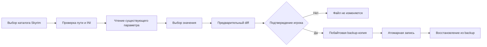

# FrameForge

FrameForge не обещает универсальный прирост FPS. Результат зависит от компьютера, разрешения, драйверов, модов и сцены. Изменения игровых файлов выполняются только после просмотра diff и отдельного подтверждения.

## Возможности

- Локальный обзор CPU, потоков, RAM, системного диска и, если доступен Windows CIM, названия GPU.
- Read-only обнаружение Skyrim в Steam через `libraryfolders.vdf` и `appmanifest_489830.acf`.
- Каталог 13 популярных игр: два обратимых профиля травы для Skyrim Special Edition и внутриигровые рекомендации для ещё 12 игр.
- A/B-анализ CSV времён кадров: средний FPS, 1% low, медиана и p99 frametime. Захват измерений остаётся внешним и пользовательским.
- Текстовый отчёт дополнительно показывает нормированную долю кадров по каждому диапазону и предупреждает о заметно различающемся размере выборок.
- Экспорт сравнения в CSV или JSON содержит только сводные метрики и распределение, без имени исходного файла, пути или сырых кадров. Имя профиля/версии игры в экспорт не включается, чтобы не раскрывать его косвенно.
- Диаграмма сравнивает долю кадров по шести диапазонам времени — от быстрых кадров до редких длинных задержек.
- История сохраняет до 100 сводок замеров между запусками. В `%LOCALAPPDATA%\FrameForge\benchmarks.json` записываются имя CSV, числовые метрики, необязательные метки игры/сцены, заметка об изменении до 160 символов и, только по отдельному флажку, снимок одного текущего разрешённого параметра Skyrim. Снимок включает только имя ключа и целое значение; путь к INI, исходные CSV, кадры и абсолютные пути не сохраняются. Снимок считывается через ту же проверку allowlist, что и профиль. Метки, заметка и снимок остаются на этом компьютере и не включаются в отчёты CSV/JSON. Не вводи в метки и заметки личные пути или другие чувствительные данные. При разных метках сравнение предупреждает, что прогоны могут быть несопоставимы.
- Предварительный unified diff, побайтовая backup-копия с SHA-256, атомарная запись и откат с проверкой сохранённой контрольной суммы.
- Отказ от неправильного/неизвестного файла, отсутствующего или повторного ключа, неразрешённых значений, symlink и Windows junction/reparse point.
- Перед заменой FrameForge сверяет SHA-256 текущего INI с ожидаемым, затем повторно проверяет allowlist пути и reparse points. Эти проверки не атомарны: правка содержимого или обычная замена INI после проверки хэша, но до `os.replace`, не обнаруживается и может быть перезаписана, если путь всё ещё проходит проверку. Junction, появившийся до повторной проверки пути, приводит к отказу. Если родительский каталог переименован и заменён junction уже после этой проверки, временный файл, созданный заранее в исходном каталоге, обычно становится недоступен по прежнему пути и `os.replace` завершается ошибкой; подмена самого INI в том же каталоге после проверки всё ещё может быть заменена. FrameForge не использует handle-based I/O и не защищает от конкурентных локальных процессов.
- Без сетевых вызовов, аналитики, аккаунта, инжекторов, правок реестра, «чистки RAM», разгона, остановки служб и обхода античита.

## Установка и запуск

Готовая Windows-сборка будет доступна в [последнем GitHub Release](https://github.com/GhosTnever-lkm/frameforge/releases/latest). Распакуй архив и запусти `FrameForge\FrameForge.exe`; установка и права администратора не нужны.

Для запуска из исходного кода нужен Python 3.10+ и Qt for Python Essentials:

```powershell
python -m venv .venv
.\.venv\Scripts\Activate.ps1
python -m pip install -e .
frameforge
```

Для локальной сборки portable-папки с `.exe` выполни `./build_windows.ps1` из PowerShell на Windows. Архив и SHA-256 появятся в `dist/`.

В интерфейсе открой **Оптимизатор**, выбери `Documents\My Games\Skyrim Special Edition`, проверь текущее значение и diff. Закрой игру перед применением, чтобы она не перезаписала настройки. Нажми «Применить» и подтверди действие. Копии сохраняются в `%LOCALAPPDATA%\FrameForge\backups`.

## Профиль Skyrim Special Edition

FrameForge поддерживает два существующих ключа в стандартной папке `Documents\My Games\Skyrim Special Edition`:

- `SkyrimPrefs.ini` → `[Grass] fGrassStartFadeDistance`: 1000, 3000, 5000 или 7000. Меньшее значение сокращает дальность отображения травы, поэтому pop-in будет заметнее. [Описание параметра](https://stepmodifications.org/wiki/Guide:SkyrimPrefs_INI/Grass).
- `Skyrim.ini` → `[Grass] iMinGrassSize`: 40, 60, 80 или 0. 40/60/80 постепенно уменьшают плотность травы; `0` убирает траву полностью и резко меняет картинку. Отрицательные значения недоступны, поскольку руководство предупреждает о возможных вылетах. [Описание плотности травы](https://stepmodifications.org/wiki/Guide:Skyrim_INI/Grass).

Изменение значения `iMinGrassSize` не является гарантией конкретного прироста FPS: эффект зависит от сцены, модов и системы.

Если ключа нет, он повторяется, файл находится вне текущей папки Documents или у игры отдельный профиль Mod Organizer, FrameForge остановится и ничего не запишет. На Windows папка Documents определяется через [`SHGetKnownFolderPath`](https://learn.microsoft.com/en-us/windows/win32/api/shlobj_core/nf-shlobj_core-shgetknownfolderpath), поэтому приложение учитывает перенаправление Documents в OneDrive. Проверяй, что выбранный файл действительно используется твоим профилем. Пример «чёрное небо» не включён: для него нужны модификации ресурсов/шейдеров, а универсального безопасного переключателя нет.

## Каталог игр

CS2, Dota 2, Apex Legends, PUBG: Battlegrounds, Fortnite, VALORANT, Minecraft Java Edition, Cyberpunk 2077, GTA V, The Witcher 3, Rust и Warframe доступны как рекомендации внутри игры. FrameForge не редактирует их файлы и античит-защищённые настройки.

Для ручной проверки меняй по одному параметру: тени, объёмные эффекты, отражения и дальность растительности. Снижай render scale только если ограничение идёт со стороны GPU. Подбирай качество текстур по доступной видеопамяти, ограничивай частоту кадров с учётом дисплея. Сравнивай одну и ту же сцену.

## Анализ замеров

На странице **Бенчмарк** можно импортировать собственный CSV с колонкой `frame_time_ms` или CSV PresentMon с `MsBetweenDisplayChange` / `MsBetweenPresents`. Если присутствуют оба столбца PresentMon, используется `MsBetweenDisplayChange`; иначе берётся `MsBetweenPresents`, и приложение предупреждает, что сравнивается CPU-presented frametime. Для этих столбцов `FrameType` тоже учитывается: displayed принимает `Application`, `Intel_XEFG` и `AMD_AFMF`, а CPU-presented — только `Application`. Импорт предупреждает о неизвестных или отброшенных строках. Поддерживаются разделители запятая, точка с запятой и табуляция; десятичная запятая принимается с `;` и табуляцией.

Сводка показывает средний FPS, 1% low, медиану и p99 frametime. Диаграмма сравнивает долю кадров в шести диапазонах: `<8,333`, `[8,333–16,667)`, `[16,667–33,333)`, `[33,333–50)`, `[50–100)` и `≥100` мс. Пороги соответствуют `1000/FPS`, подписи округлены. В легенде указано число кадров для каждого замера. При малом количестве кадров распределение менее устойчиво; приложение предупреждает, если размер выборок различается более чем на 5%.

Для каждого прогона можно добавить локальную заметку об изменении настроек. A/B-отчёт показывает обе заметки только как пользовательский контекст и явно говорит, что они не доказывают причину изменения FPS. По отдельному флажку можно также считать текущий разрешённый параметр Skyrim, выбранный в **Оптимизаторе**. Снимок читается через существующие проверки пути и allowlist и сохраняет только пару `имя ключа + целое значение`. Если папка Skyrim не выбрана или путь не прошёл проверку, импорт отменяется. Снимок относится ко времени импорта CSV и сам по себе не подтверждает, что замер был сделан именно при этом значении.

До 100 последних сводок хранятся локально в `%LOCALAPPDATA%\FrameForge\benchmarks.json`. История содержит имя CSV, метрики и выбранные пользователем локальные метки, заметки и снимки; исходный CSV, отдельные кадры и абсолютные пути не сохраняются. Метки, заметки и снимки не включаются в экспорт CSV/JSON. Тип метрики включается в экспорт; сравнение разных типов остаётся доступным, но явно помечается как напрямую несопоставимое. Доля в правых диапазонах показывает, что в прогоне было больше медленных кадров, но не устанавливает причину разницы. Повторяй замеры на одной сцене и в одинаковых условиях. Например:

```csv
frame_time_ms
16.7
16.4
22.1
```

Импортируй два замера и выбери Baseline (A) и Variant (B). 1% low рассчитывается как обратное среднее времени худшего 1% кадров. FrameForge не захватывает кадры самостоятельно, не внедряется в игры и не устанавливает причинную связь между настройкой и результатом.

## Схема безопасного применения



## Проверки

```powershell
python -m pip install -e .
python -m unittest discover -s tests -v
python -m compileall -q src tests
```

## Ограничения

- Версия 0.4.0 добавляет нормированные дельты по диапазонам frametime и предупреждение при разном числе кадров; история хранится локально.
- Версия 0.5.0 добавляет локальный экспорт агрегированной A/B-сводки в CSV и JSON.
- Версия 0.6.0 добавила локальные метки игры и сцены/пресета к замерам. Версия 0.7.0 добавила тип метрики и заметку об изменении; версия 0.8.0 добавила opt-in снимок разрешённого параметра Skyrim. Локальная история использует схему v5 и мигрирует схемы v1–v4 при чтении. Старые версии FrameForge могут не читать историю после обновления формата. Название метрики включается в CSV/JSON экспорт, пользовательские метки, заметки и снимки — нет.
- Только Skyrim имеет обратимые автоматические профили; остальные 12 игр сопровождаются внутриигровыми чек-листами.
- Health scan не измеряет FPS, температуры или нагрузку GPU и ничего не меняет в системе.
- Соревновательные игры остаются в режиме рекомендаций, чтобы не задевать файлы, Steam Cloud и античит.
- Графический интерфейс этой версии на русском языке.

## Лицензия

MIT. См. [LICENSE](LICENSE).

## ☕ Support / Pro Version

FrameForge бесплатен и открыт под MIT. Пока нет отдельной Pro-функциональности, которую можно честно предложить за деньги; поддержка не включает закрытые функции. [Buy Me a Coffee](https://buymeacoffee.com/azizazimov8) · [Boosty](https://boosty.to/azizazim).

## Источники выбора игр

Список — практический каталог, не рейтинг и не обещание поддержки автоматических настроек. Для выбора игр ориентировались на публичные [Steam Charts](https://store.steampowered.com/charts/) и [PC & Console Rankings by Newzoo](https://newzoo.com/articles/july-2026-pc-console-rankings).
